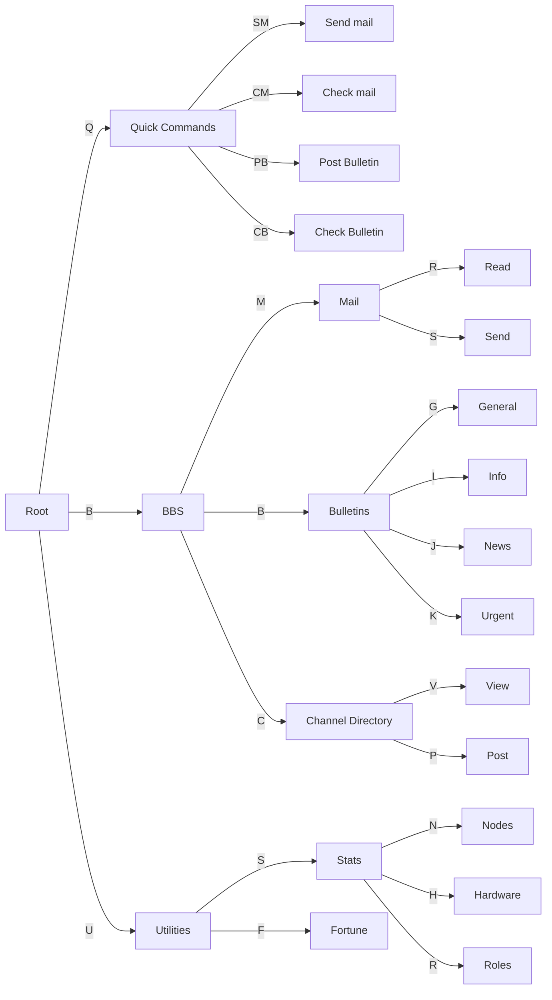

# BBS

We run a bulletin board system with a built-in mail system and channel directory! 

<warning>
- Don't share sensitive or private information.  
- No spam, harassment, or other unwanted behavior.  
- Moderators may delete posts if needed.  
- If a post is inappropriate or if you have any issues with the system itself, please let me know.
</warning>

## Topics
<tabs>
<tab title="General">
Post general stuff here.
</tab>
<tab title="Info">

</tab>
<tab title="News">
Have any important news to share? Post it here!
</tab>
<tab title="Urgent">
Reserved for emergency situations. 
</tab>
</tabs>

## How to
Just send a message over to KYBB! From there you should get a message with the command tree.
Once in the command tree, you can use the commands key code (surrounded in brackets) to execute the command.

### Command Tree

## Contact
- Discord: firewire_
- Mesh: FWM or FWMQ